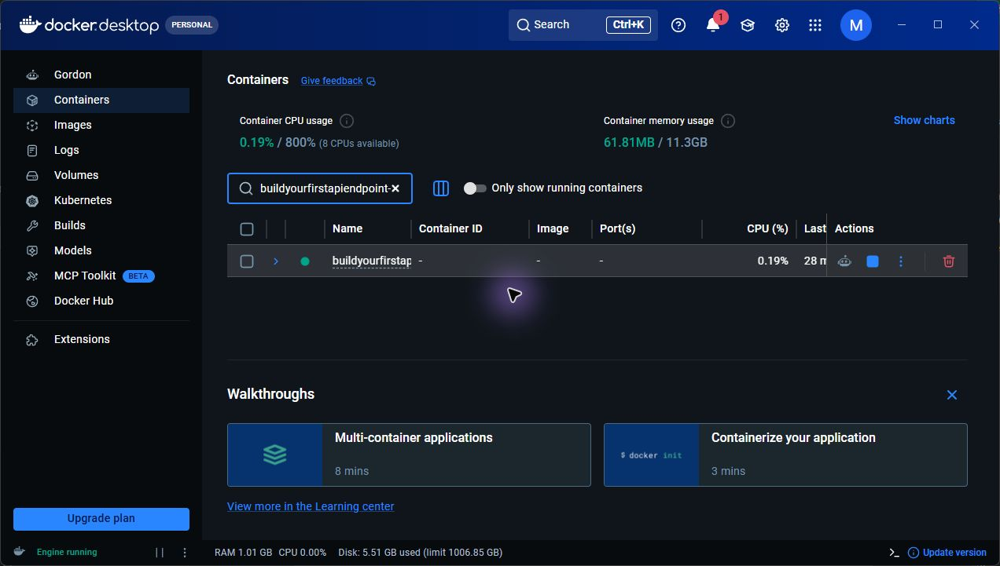

# Task CRUD API with PostgreSQL

A FastAPI task API backed by PostgreSQL. Docker Compose starts the API and database together; the original `/` and `/health` endpoints and the five task routes keep their A2 behavior.

## Run the stack

Install and start Docker Desktop, then clone this repository. From the project folder:

```powershell
Copy-Item .env.example .env
docker compose up --build
```

The API is available at <http://localhost:3000>. Compose creates the `tasks` table and inserts the three example tasks only when it is empty. The committed `.env.example` lists the required variables; `.env` contains local settings and is ignored by Git. Change its placeholder password before exposing this stack beyond your machine.

Stop the stack with `Ctrl+C`. Run `docker compose down` and then `docker compose up --build` to verify that task rows persist in the Compose-managed `taskdata` volume. Do not add `-v` when checking persistence; that removes the data volume.

## Endpoints

| Method | Route | Success |
| --- | --- | --- |
| `GET` | `/` | `200`, API status |
| `GET` | `/health` | `200`, service status |
| `GET` | `/tasks` | `200`, array of tasks |
| `GET` | `/tasks/{id}` | `200`, task |
| `POST` | `/tasks` | `201`, created task |
| `PUT` | `/tasks/{id}` | `200`, updated task |
| `DELETE` | `/tasks/{id}` | `204`, empty body |

Tasks have the shape `{"id": 1, "title": "Learn FastAPI", "done": false}`. Create requests need a non-empty `title`; update requests need a non-empty `title` and boolean `done`. Invalid bodies return `400` with a JSON error. Unknown IDs return `404` with `{"error":"Task not found"}`.

Example response from `curl.exe -i http://localhost:3000/tasks`:

```text
HTTP/1.1 200 OK
date: Mon, 21 Sep 2026 21:22:42 GMT
server: uvicorn
content-length: 143
content-type: application/json

[{"id":1,"title":"Learn FastAPI","done":false},{"id":2,"title":"Connect SQLite","done":false},{"id":3,"title":"Build a CRUD API","done":false}]
```

## Verify and inspect PostgreSQL

Run the API contract checks against a temporary PostgreSQL database:

```powershell
docker compose exec api python -m unittest -v
```

Inspect the running database directly:



The green status indicator above shows the live `buildyourfirstapiendpoint` Compose project. Its `db` service uses PostgreSQL 16 Alpine; the direct `psql` output below verifies the table and rows inside that database.

```powershell
docker compose exec db psql -U postgres -d tasks -c "\\dt"
docker compose exec db psql -U postgres -d tasks -c "SELECT * FROM tasks ORDER BY id;"
```

The SQL practice statements are in [`queries.sql`](queries.sql). Direct output from PostgreSQL after `docker compose up --build`:

```text
$ docker compose exec db psql -U postgres -d tasks -c "\\dt"
         List of relations
 Schema | Name  | Type  |  Owner
--------+-------+-------+----------
 public | tasks | table | postgres
(1 row)

$ docker compose exec db psql -U postgres -d tasks -c "SELECT * FROM tasks ORDER BY id;"
 id |      title       | done
----+------------------+------
  1 | Learn FastAPI    | f
  2 | Connect SQLite   | f
  3 | Build a CRUD API | f
(3 rows)
```
