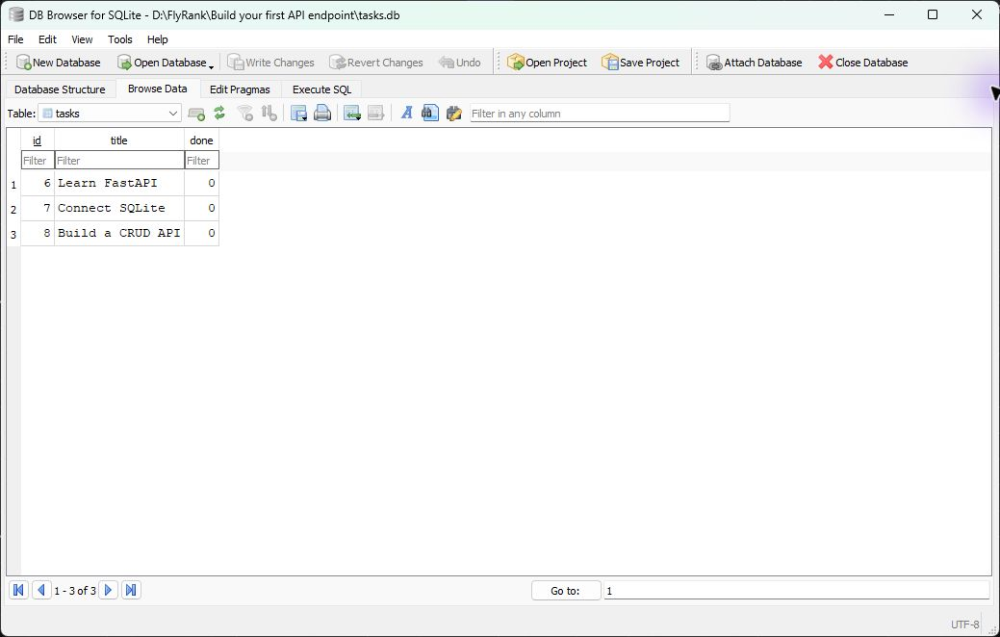

# Task CRUD API with SQLite

A small FastAPI task API backed by SQLite. The original `/` and `/health` endpoints remain available.

## Run locally

Python 3.10 or newer is required. From the project folder:

```powershell
py -m venv .venv
.\.venv\Scripts\Activate.ps1
pip install -r requirements.txt
uvicorn main:app --reload
```

On first start, the app creates `tasks.db` beside `main.py`, creates the `tasks` table, and inserts three example tasks only if the table is empty. SQLite is a good fit here because it is built into Python, needs no database server, and persists in one file. The database is ignored by Git so each clone starts with its own example data.

## Endpoints

| Method | Route | Success |
| --- | --- | --- |
| `GET` | `/tasks` | `200`, array of tasks |
| `GET` | `/tasks/{id}` | `200`, task |
| `POST` | `/tasks` | `201`, created task |
| `PUT` | `/tasks/{id}` | `200`, updated task |
| `DELETE` | `/tasks/{id}` | `204`, empty body |

Tasks have the shape `{"id": 1, "title": "Learn FastAPI", "done": false}`. Create requests require a non-empty `title`; update requests require a non-empty `title` and boolean `done`. Invalid bodies return `400`. Unknown IDs return `404` with `{"error":"Task not found"}`.

Example requests:

```powershell
curl.exe -i http://127.0.0.1:8000/tasks
curl.exe -i http://127.0.0.1:8000/tasks/999
curl.exe -i -X POST http://127.0.0.1:8000/tasks -H "Content-Type: application/json" -d '{"title":"Buy milk"}'
curl.exe -i -X PUT http://127.0.0.1:8000/tasks/4 -H "Content-Type: application/json" -d '{"title":"Buy milk","done":true}'
curl.exe -i -X DELETE http://127.0.0.1:8000/tasks/4
```

## Verify persistence and SQL

Run the API lifecycle check with:

```powershell
python -m unittest -v
```

Create a task, restart Uvicorn, then call `GET /tasks` to confirm it remains. Open `tasks.db` in DB Browser for SQLite to see the same rows. The required practice statements are in [`queries.sql`](queries.sql):

```sql
SELECT COUNT(*) FROM tasks;
```

With the fresh database, this returned `3` example tasks. After the manual `UPDATE` and `DELETE` practice, restart the app to recreate a fresh three-task database for review.


