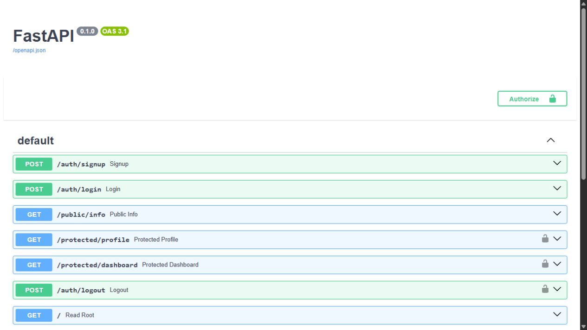
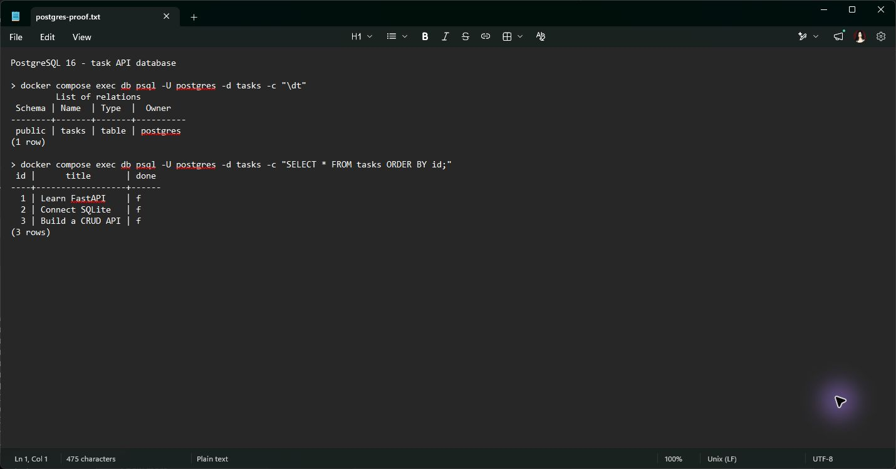

# FlyRank Auth API

A FastAPI task API backed by PostgreSQL with Supabase Auth sign-up, login, bearer-token verification, protected routes, logout, and Swagger UI documentation.

## Setup

1. Create a free Supabase project.
2. In Authentication settings, disable Confirm email for this practice flow.
3. Copy `.env.example` to `.env` and set the Supabase project URL and anon/publishable key. Keep `.env` local; never commit it.

```powershell
Copy-Item .env.example .env
docker compose up --build
```

The API is available at <http://localhost:3000>. Swagger UI is at <http://localhost:3000/docs>.

## API reference

| Method | Route | Auth | Success |
| --- | --- | --- | --- |
| `POST` | `/auth/signup` | No | `201` with safe user fields |
| `POST` | `/auth/login` | No | `200` with access and refresh tokens |
| `POST` | `/auth/logout` | Bearer token | `204` with no body |
| `GET` | `/protected/profile` | Bearer token | `200` with the current user |
| `GET` | `/protected/dashboard` | Bearer token | `200` with the current user ID |
| `GET` | `/public/info` | No | `200` with public information |
| `GET` | `/` | No | `200` API status |
| `GET` | `/health` | No | `200` service status |

The existing task CRUD routes remain unchanged: `GET /tasks`, `GET /tasks/{id}`, `POST /tasks`, `PUT /tasks/{id}`, and `DELETE /tasks/{id}`. They retain their existing validation and PostgreSQL behavior.

Missing or malformed credentials return `401` with `{"error":"Access token required"}`. Invalid, expired, or tampered tokens return `401` with `{"error":"Invalid or expired token"}`. Missing signup/login fields return `400`.

## Curl flow

```powershell
curl.exe -i -X POST http://localhost:3000/auth/signup `
  -H "Content-Type: application/json" `
  -d '{"email":"test@example.com","password":"password123"}'

curl.exe -i -X POST http://localhost:3000/auth/login `
  -H "Content-Type: application/json" `
  -d '{"email":"test@example.com","password":"password123"}'
```

Copy the `access_token` from the login response and use it for protected calls:

```powershell
$token = "PASTE_ACCESS_TOKEN_HERE"
curl.exe -i http://localhost:3000/protected/profile -H "Authorization: Bearer $token"
curl.exe -i http://localhost:3000/protected/dashboard -H "Authorization: Bearer $token"
curl.exe -i http://localhost:3000/auth/logout -X POST -H "Authorization: Bearer $token"
```

Change one character in the token and call `/protected/profile` again; the API must return `401`.

## Swagger verification

Open `/docs`, select **Authorize**, paste the access token, and run `GET /protected/profile`. Protected routes show the BearerAuth lock icon and public routes remain open.



## Tests

The test suite keeps the PostgreSQL CRUD regression coverage and adds mocked Supabase checks for authentication, protected routes, logout, and OpenAPI security metadata.

```powershell
docker compose exec api python -m unittest -v
```

The live signup/login/profile/dashboard/tampered-token/logout flow and Swagger screenshot require a configured Supabase project. Do not print or commit Supabase credentials.

## Submission checklist

Before publishing, confirm the full curl and Swagger flows pass, `docs/swagger-auth.png` shows the authorized profile call, `.env` is ignored, and `git log --all -- .env` returns no entries.

## Verify and inspect PostgreSQL

Run the API contract checks against a temporary PostgreSQL database:

```powershell
docker compose exec api python -m unittest -v
```

Inspect the running database directly:



The screenshot above was captured from the running PostgreSQL 16 container and shows the `tasks` table plus its three seeded rows.

```powershell
docker compose exec db psql -U postgres -d tasks -c "\dt"
docker compose exec db psql -U postgres -d tasks -c "SELECT * FROM tasks ORDER BY id;"
```

The SQL practice statements are in [`queries.sql`](queries.sql). Direct output from PostgreSQL after `docker compose up --build`:

```text
$ docker compose exec db psql -U postgres -d tasks -c "\dt"
         List of relations
 Schema | Name  | Type  |  Owner
--------+-------+-------+----------
 public | tasks | table | postgres
(1 row)

$ docker compose exec db psql -U postgres -d tasks -c "SELECT * FROM tasks ORDER BY id;"
 id |      title       | done
----+------------------+------
  1 | Learn FastAPI    | f
  2 | Connect SQLite   | f
  3 | Build a CRUD API | f
(3 rows)
```
